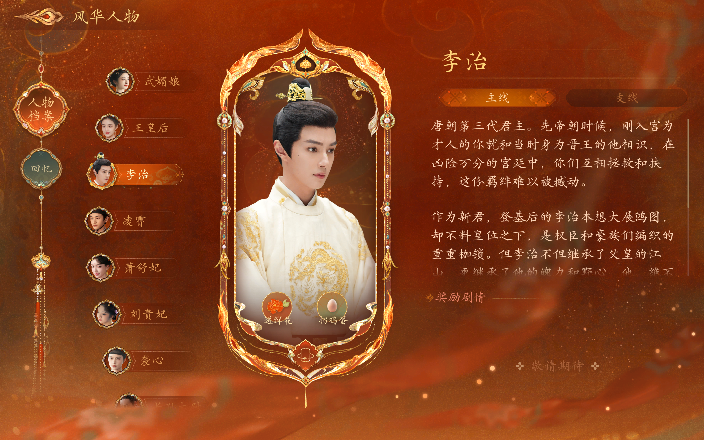
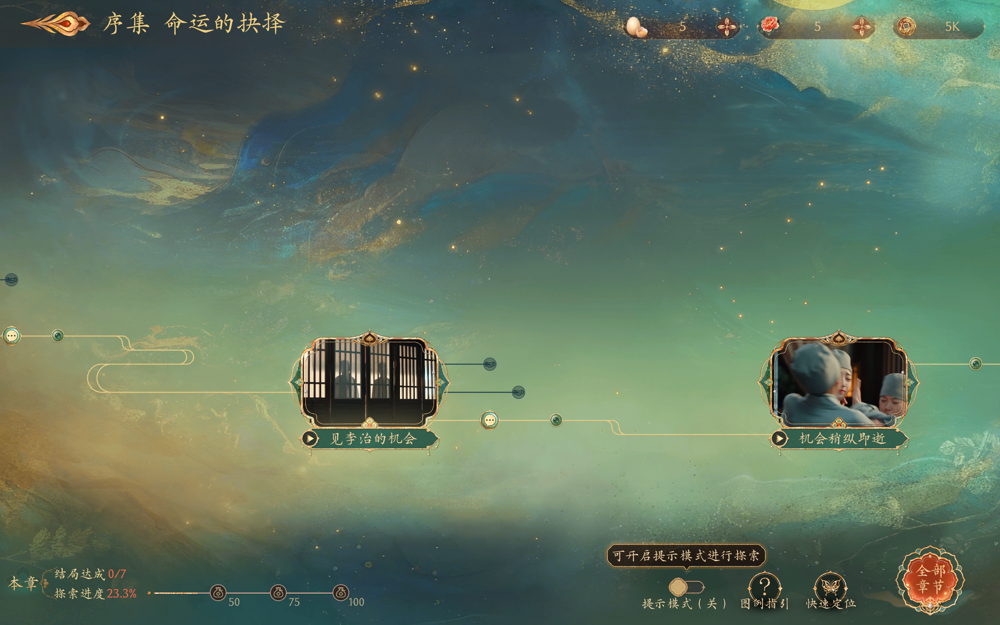

# 女帝篇 — 和谐人名还原工具 v1.7

还原《女王的游戏：盛世天下》女帝篇中被和谐的唐朝历史人名。

游戏中的大量历史人名被谐音替换（李唐皇室改姓"礼"、武氏改姓"伍"、国号"唐"改为"盛"、首都"长安"改为"盛安"等），本工具通过二进制级别的等字节替换，将所有名称还原为历史原名。

**设计理念**：保持游戏原名，仅替换姓氏和特定人名。例如"伍元照"还原为"武元照"（保持游戏原名），而非"武则天"（历史名）。

## 效果展示（替换后）







## 还原对照表（18对，简体+繁体）

游戏的繁体中文版本（zh_TW）使用繁体字形（如"禮治"代替"礼治"），且章节目录文件（chapter*.pbin 等）为所有语言共用，同时包含简繁两种字形。本工具会自动识别文件类型，对简体和繁体字形均进行替换。

### 姓氏替换（单字）

| 游戏姓氏 | → | 历史姓氏 | 说明 |
|---------|---|---------|------|
| 伍 | → | 武 | 武氏姓氏（覆盖所有伍元照、伍媚娘、伍氏、伍周等） |

### 人名替换

| 简体游戏名 | 繁体游戏名 | → | 简体历史名 | 繁体历史名 | 说明 |
|-----------|-----------|---|----------|----------|------|
| 礼治 | 禮治 | → | 李治 | 李治 | 唐高宗 |
| 礼世民 | 禮世民 | → | 李世民 | 李世民 | 唐太宗 |
| 礼泰 | 禮泰 | → | 李泰 | 李泰 | 魏王 |
| 礼弘 | 禮弘 | → | 李弘 | 李弘 | 太子 |
| 礼贤 | 禮賢 | → | 李贤 | 李賢 | 章怀太子 |
| 礼显 | 禮顯 | → | 李显 | 李顯 | 唐中宗 |
| 礼旦 | 禮旦 | → | 李旦 | 李旦 | 唐睿宗 |
| 礼勣 | 禮勣 | → | 李勣 | 李勣 | 凌烟阁功臣 |
| 礼敬业 | 禮敬業 | → | 徐敬业 | 徐敬業 | 起兵反武之人 |
| 礼氏 | 禮氏 | → | 李氏 | 李氏 | 李唐皇族(宗族) |

### 其他替换

| 简体游戏名 | 繁体游戏名 | → | 简体历史名 | 繁体历史名 | 说明 |
|-----------|-----------|---|----------|----------|------|
| 高扬 | 高揚 | → | 高阳 | 高陽 | 高阳公主 |
| 上官宜 | 上官宜 | → | 上官仪 | 上官儀 | 太子太傅 |
| 楚遂良 | 楚遂良 | → | 褚遂良 | 褚遂良 | 宰相 |
| 丘神绩 | 丘神績 | → | 丘神勣 | 丘神勣 | 将领 |
| 狄任介 | 狄任介 | → | 狄仁杰 | 狄仁傑 | 朝臣 |
| 盛朝 | 盛朝 | → | 唐朝 | 唐朝 | 国号 |
| 盛安 | 盛安 | → | 长安 | 長安 | 首都 |

## 使用方法

### 方式一：双击运行（推荐，无需任何依赖）

1. 下载本仓库：**[点击下载 ZIP](https://github.com/shin4/empress-name-restore/archive/refs/heads/master.zip)**
2. **解压 ZIP 到任意文件夹**（不能直接在压缩包内运行）
3. 进入解压后的文件夹，双击 **`启动还原工具.bat`**
4. 工具会自动搜索 Steam 游戏目录，显示菜单：
   ```
   [1] 替换人名（还原历史原名）
   [2] 验证人名替换结果
   [3] 还原人名为游戏原始版本
   [4] 替换字幕（还原历史原名）
   [5] 验证字幕替换结果
   [6] 还原字幕为游戏原始版本
   [7] 退出
   ```
5. 输入 `1` 回车即可完成人名替换，输入 `4` 回车即可完成字幕替换

> 首次运行自动备份原始文件，可随时通过菜单 `[3]` 或 `[6]` 还原。

### 方式二：Node.js 脚本（适合开发者）

需要 [Node.js](https://nodejs.org/)，将脚本文件放入游戏目录后运行：

```bash
# 人名替换
node replace_names.js    # 替换
node verify_names.js     # 验证
node restore_names.js    # 还原

# 字幕替换
node replace_subtitles.js    # 替换
node verify_subtitles.js     # 验证
node restore_subtitles.js    # 还原
```

## 工作原理

《女王的游戏：盛世天下》女帝篇基于 Unity 引擎，使用 protobuf 格式存储游戏数据。人物名称存储在 `TextClient*.pbin` 这类 **明文 protobuf** 文件中（共 80 个），而游戏逻辑配置（`CharacterConfig.pbin` 等 44 个文件）使用 AES 加密。

关键架构：游戏采用 **ID 与文本分离** 的设计——加密的 Config 文件只存储结构化数据和 ID 引用（如 `TID_CharacterConfig_519619`），所有显示文本（包括人名）都在明文的 TextClient 文件中。因此只需修改明文文件即可完成全局替换。

所有 23 对替换均为 **等字节替换**（UTF-8 编码下新旧名长度相同），不会破坏 protobuf 的 varint 长度字段，保证游戏正常解析。

## 自定义

编辑 `name_mapping.json` 可增删替换对：

```json
{
  "replacements": [
    { "from": "伍元照", "to": "武则天", "desc": "女主角本名" }
  ]
}
```

所有替换必须满足等字节条件（UTF-8 编码下 `from` 和 `to` 字节数相同）。

## 许可证

[MIT License](LICENSE)
